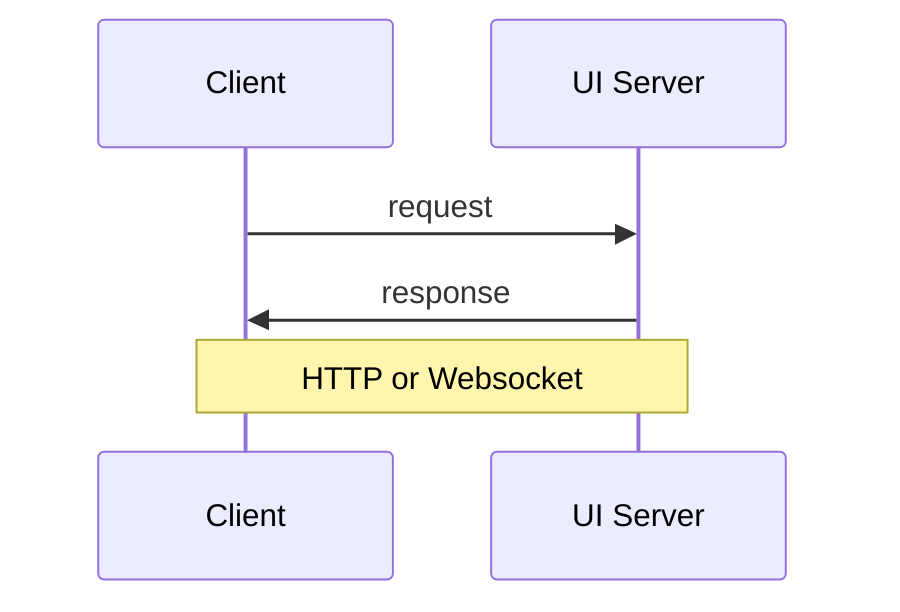

<!-- markdownlint-disable-file MD033 MD024 -->
<div align="center">

# [e-Mobility charging stations simulator](https://github.com/sap/e-mobility-charging-stations-simulator)

</div>

<div align="center">

[](https://github.com/SAP/e-mobility-charging-stations-simulator/graphs/traffic)
[](https://github.com/SAP/e-mobility-charging-stations-simulator/graphs/commit-activity)
[](https://github.com/SAP/e-mobility-charging-stations-simulator/actions/workflows/ci.yml)
[](https://api.reuse.software/info/github.com/SAP/e-mobility-charging-stations-simulator)
[](https://github.com/neostandard/neostandard)

</div>

Simple [node.js](https://nodejs.org/) software to simulate and scale a set of charging stations based on the OCPP-J protocol as part of [SAP e-Mobility](https://www.sap.com/products/scm/e-mobility.html) solution.

## Table of contents

- [Installation](#installation)
  - [Prerequisites](#prerequisites)
    - [Windows](#windows)
    - [MacOSX](#macosx)
    - [GNU/Linux](#gnulinux)
  - [Development prerequisites (optional)](#development-prerequisites-optional)
    - [Unix](#unix)
    - [Windows](#windows-1)
  - [Branching model](#branching-model)
  - [Dependencies](#dependencies)
- [Initial configuration](#initial-configuration)
- [Start simulator](#start-simulator)
- [Start Web UI](#start-web-ui)
- [Configuration files syntax](#configuration-files-syntax)
  - [Charging stations simulator configuration](#charging-stations-simulator-configuration)
  - [Charging station template configuration](#charging-station-template-configuration)
  - [Charging station configuration](#charging-station-configuration)
- [Docker](#docker)
- [OCPP-J commands supported](#ocpp-j-commands-supported)
  - [Version 1.6](#version-16)
  - [Version 2.x.x](#version-2xx)
- [OCPP-J standard parameters supported](#ocpp-j-standard-parameters-supported)
  - [Version 1.6](#version-16-1)
  - [Version 2.x.x](#version-2xx-1)
- [UI Protocol](#ui-protocol)
  - [Websocket Protocol](#websocket-protocol)
  - [HTTP Protocol](#http-protocol)
- [Support, Feedback, Contributing](#support-feedback-contributing)
- [Code of Conduct](#code-of-conduct)
- [Licensing](#licensing)

## Installation

### Prerequisites

Install the [node.js](https://nodejs.org/) current LTS or superior version runtime environment:

#### Windows

- [Chocolatey](https://chocolatey.org/):

```powershell
choco install -y nodejs
```

#### MacOSX

- [Homebrew](https://brew.sh/):

```shell
brew install node
```

#### GNU/Linux

- [NodeSource](https://github.com/nodesource/distributions) node.js binary distributions for all supported versions.

### Development prerequisites (optional)

Install [volta](https://volta.sh/) for managing automatically the node.js runtime and package manager version:

#### Unix

```shell
curl https://get.volta.sh | bash
```

#### Windows

```powershell
choco install -y volta
```

Setup [volta](https://volta.sh/) with [pnpm](https://github.com/pnpm/pnpm) package manager support: https://docs.volta.sh/advanced/pnpm

### Branching model

The `main` branch is the default development branch.  
The `vX` branches are the maintenance branches for the corresponding major version `X`.  
The `vX.Y` branches are the maintenance branches for the corresponding major and minor version `X.Y`.

### Dependencies

Enable corepack, if [volta](https://volta.sh/) is not installed and configured, and install latest pnpm version:

```shell
corepack enable
corepack prepare pnpm@latest --activate
```

In the repository root, run the following command:

```shell
pnpm install
```

## Initial configuration

Copy the configuration template file [src/assets/config-template.json](./src/assets/config-template.json) to [src/assets/config.json](./src/assets/config.json).  
Copy the RFID tags template file [src/assets/idtags-template.json](./src/assets/idtags-template.json) to [src/assets/idtags.json](./src/assets/idtags.json).

Tweak them to your needs by following the section [configuration files syntax](#configuration-files-syntax): OCPP server supervision URL(s), charging station templates, etc.

## Start simulator

```shell
pnpm start
```

## Start Web UI

See Web UI [README.md](./ui/web/README.md) for more information.

## Configuration files syntax

All configuration files are using the JSON standard syntax.

**Configuration files locations**:

- charging stations simulator configuration: [src/assets/config.json](./src/assets/config.json);
- charging station configuration templates: [src/assets/station-templates](./src/assets/station-templates);
- charging station configurations: [dist/assets/configurations](./dist/assets/configurations);
- charging station RFID tags lists: [src/assets](./src/assets).

The charging stations simulator's configuration parameters must be within the `src/assets/config.json` file. A charging station simulator configuration template file is available at [src/assets/config-template.json](./src/assets/config-template.json).

All charging station configuration templates are in the directory [src/assets/station-templates](./src/assets/station-templates).

A list of RFID tags must be defined for the automatic transaction generator in a file with the default location and name: `src/assets/idtags.json`. A template file is available at [src/assets/idtags-template.json](./src/assets/idtags-template.json).

**Configuration files hierarchy and priority**:

1. charging station configuration: [dist/assets/configurations](./dist/assets/configurations);
2. charging station configuration template: [src/assets/station-templates](./src/assets/station-templates);
3. charging stations simulator configuration: [src/assets/config.json](./src/assets/config.json).

The charging stations simulator has an automatic configuration files reload feature at change for:

- charging stations simulator configuration;
- charging station configuration templates;
- charging station authorization RFID tags lists.

But the modifications to test have to be done to the files in the build target directory [dist/assets](./dist/assets). Once the modifications are done, they have to be reported to the matching files in the build source directory [src/assets](./src/assets) to ensure they will be taken into account at next build.

### Charging stations simulator configuration

**src/assets/config.json**:

| Key                        | Value(s)                                     | Default Value                                                                                                                                                                                                                 | Value type                                                                                                                                                                                                                                                                      | Description                                                                                                                                                                                                                                                                                                                                                                                                                                                                                                                                                                                                                                                                                                                                                                                                                                                                                                     |
| -------------------------- | -------------------------------------------- | ----------------------------------------------------------------------------------------------------------------------------------------------------------------------------------------------------------------------------- | ------------------------------------------------------------------------------------------------------------------------------------------------------------------------------------------------------------------------------------------------------------------------------- | --------------------------------------------------------------------------------------------------------------------------------------------------------------------------------------------------------------------------------------------------------------------------------------------------------------------------------------------------------------------------------------------------------------------------------------------------------------------------------------------------------------------------------------------------------------------------------------------------------------------------------------------------------------------------------------------------------------------------------------------------------------------------------------------------------------------------------------------------------------------------------------------------------------- |
| supervisionUrls            |                                              | []                                                                                                                                                                                                                            | string \| string[]                                                                                                                                                                                                                                                              | string or strings array containing global connection URIs to OCPP-J servers                                                                                                                                                                                                                                                                                                                                                                                                                                                                                                                                                                                                                                                                                                                                                                                                                                     |
| supervisionUrlDistribution | round-robin/random/charging-station-affinity | charging-station-affinity                                                                                                                                                                                                     | string                                                                                                                                                                                                                                                                          | supervision urls distribution policy to simulated charging stations                                                                                                                                                                                                                                                                                                                                                                                                                                                                                                                                                                                                                                                                                                                                                                                                                                             |
| log                        |                                              | {<br />"enabled": true,<br />"file": "logs/combined.log",<br />"errorFile": "logs/error.log",<br />"statisticsInterval": 60,<br />"level": "info",<br />"console": false,<br />"format": "simple",<br />"rotate": true<br />} | {<br />enabled?: boolean;<br />file?: string;<br />errorFile?: string;<br />statisticsInterval?: number;<br />level?: string;<br />console?: boolean;<br />format?: string;<br />rotate?: boolean;<br />maxFiles?: string \| number;<br />maxSize?: string \| number;<br />}    | Log configuration section:<br />- _enabled_: enable logging<br />- _file_: log file relative path<br />- _errorFile_: error log file relative path<br />- _statisticsInterval_: seconds between charging stations statistics output in the logs<br />- _level_: emerg/alert/crit/error/warning/notice/info/debug [winston](https://github.com/winstonjs/winston) logging level</br >- _console_: output logs on the console<br />- _format_: [winston](https://github.com/winstonjs/winston) log format<br />- _rotate_: enable daily log files rotation<br />- _maxFiles_: maximum number of log files: https://github.com/winstonjs/winston-daily-rotate-file#options<br />- _maxSize_: maximum size of log files in bytes, or units of kb, mb, and gb: https://github.com/winstonjs/winston-daily-rotate-file#options                                                                                        |
| worker                     |                                              | {<br />"processType": "workerSet",<br />"startDelay": 500,<br />"elementAddDelay": 0,<br />"elementsPerWorker": 'auto',<br />"poolMinSize": 4,<br />"poolMaxSize": 16<br />}                                                  | {<br />processType?: WorkerProcessType;<br />startDelay?: number;<br />elementAddDelay?: number;<br />elementsPerWorker?: number \| 'auto' \| 'all';<br />poolMinSize?: number;<br />poolMaxSize?: number;<br />resourceLimits?: ResourceLimits;<br />}                         | Worker configuration section:<br />- _processType_: worker threads process type (`workerSet`/`fixedPool`/`dynamicPool`)<br />- _startDelay_: milliseconds to wait at worker threads startup (only for `workerSet` worker threads process type)<br />- _elementAddDelay_: milliseconds to wait between charging station add<br />- _elementsPerWorker_: number of charging stations per worker threads for the `workerSet` process type (`auto` means (number of stations) / (number of CPUs) \* 1.5 if (number of stations) > (number of CPUs), otherwise 1; `all` means a unique worker will run all charging stations)<br />- _poolMinSize_: worker threads pool minimum number of threads</br >- _poolMaxSize_: worker threads pool maximum number of threads<br />- _resourceLimits_: worker threads [resource limits](https://nodejs.org/api/worker_threads.html#new-workerfilename-options) object option |
| uiServer                   |                                              | {<br />"enabled": false,<br />"type": "ws",<br />"version": "1.1",<br />"options": {<br />"host": "localhost",<br />"port": 8080<br />}<br />}                                                                                | {<br />enabled?: boolean;<br />type?: ApplicationProtocol;<br />version?: ApplicationProtocolVersion;<br />options?: ServerOptions;<br />authentication?: {<br />enabled: boolean;<br />type: AuthenticationType;<br />username?: string;<br />password?: string;<br />}<br />} | UI server configuration section:<br />- _enabled_: enable UI server<br />- _type_: 'http' or 'ws'<br />- _version_: HTTP version '1.1' or '2.0'<br />- _options_: node.js net module [listen options](https://nodejs.org/api/net.html#serverlistenoptions-callback)<br />- _authentication_: authentication type configuration section                                                                                                                                                                                                                                                                                                                                                                                                                                                                                                                                                                          |
| performanceStorage         |                                              | {<br />"enabled": true,<br />"type": "none",<br />}                                                                                                                                                                           | {<br />enabled?: boolean;<br />type?: string;<br />uri?: string;<br />}                                                                                                                                                                                                         | Performance storage configuration section:<br />- _enabled_: enable performance storage<br />- _type_: 'jsonfile', 'mongodb' or 'none'<br />- _uri_: storage URI                                                                                                                                                                                                                                                                                                                                                                                                                                                                                                                                                                                                                                                                                                                                                |
| stationTemplateUrls        |                                              | {}[]                                                                                                                                                                                                                          | {<br />file: string;<br />numberOfStations: number;<br />provisionedNumberOfStations?: number;<br />}[]                                                                                                                                                                         | array of charging station templates URIs configuration section:<br />- _file_: charging station configuration template file relative path<br />- _numberOfStations_: template number of stations at startup<br />- _provisionedNumberOfStations_: template provisioned number of stations after startup                                                                                                                                                                                                                                                                                                                                                                                                                                                                                                                                                                                                         |

#### Worker process model

- **workerSet**:
  Worker set executing each a fixed number (elementsPerWorker) of simulated charging stations from the total

- **fixedPool**:
  Fixedly sized worker pool executing a fixed total number of simulated charging stations

- **dynamicPool** (experimental):
  Dynamically sized worker pool executing a fixed total number of simulated charging stations

### Charging station template configuration

**src/assets/station-templates/\<name\>.json**:

| Key                                                  | Value(s)      | Default Value                                                                                                                      | Value type                                                                                                                                                                    | Description                                                                                                                                                                                                                                  |
| ---------------------------------------------------- | ------------- | ---------------------------------------------------------------------------------------------------------------------------------- | ----------------------------------------------------------------------------------------------------------------------------------------------------------------------------- | -------------------------------------------------------------------------------------------------------------------------------------------------------------------------------------------------------------------------------------------- |
| supervisionUrls                                      |               | []                                                                                                                                 | string \| string[]                                                                                                                                                            | string or strings array containing connection URIs to OCPP-J servers                                                                                                                                                                         |
| supervisionUser                                      |               | undefined                                                                                                                          | string                                                                                                                                                                        | basic HTTP authentication user to OCPP-J server                                                                                                                                                                                              |
| supervisionPassword                                  |               | undefined                                                                                                                          | string                                                                                                                                                                        | basic HTTP authentication password to OCPP-J server                                                                                                                                                                                          |
| supervisionUrlOcppConfiguration                      | true/false    | false                                                                                                                              | boolean                                                                                                                                                                       | enable supervision URL configuration via a vendor OCPP parameter key                                                                                                                                                                         |
| supervisionUrlOcppKey                                |               | 'ConnectionUrl'                                                                                                                    | string                                                                                                                                                                        | the vendor string that will be used as a vendor OCPP parameter key to set the supervision URL                                                                                                                                                |
| autoStart                                            | true/false    | true                                                                                                                               | boolean                                                                                                                                                                       | enable automatic start of added charging station from template                                                                                                                                                                               |
| ocppVersion                                          | 1.6/2.0/2.0.1 | 1.6                                                                                                                                | string                                                                                                                                                                        | OCPP version                                                                                                                                                                                                                                 |
| ocppProtocol                                         | json          | json                                                                                                                               | string                                                                                                                                                                        | OCPP protocol                                                                                                                                                                                                                                |
| ocppStrictCompliance                                 | true/false    | true                                                                                                                               | boolean                                                                                                                                                                       | enable strict adherence to the OCPP version and protocol specifications with OCPP commands PDU validation against [OCA](https://www.openchargealliance.org/) JSON schemas                                                                    |
| ocppPersistentConfiguration                          | true/false    | true                                                                                                                               | boolean                                                                                                                                                                       | enable persistent OCPP parameters storage by charging stations 'hashId'. The persistency is ensured by the charging stations configuration files in [dist/assets/configurations](./dist/assets/configurations)                               |
| stationInfoPersistentConfiguration                   | true/false    | true                                                                                                                               | boolean                                                                                                                                                                       | enable persistent station information and specifications storage by charging stations 'hashId'. The persistency is ensured by the charging stations configuration files in [dist/assets/configurations](./dist/assets/configurations)        |
| automaticTransactionGeneratorPersistentConfiguration | true/false    | true                                                                                                                               | boolean                                                                                                                                                                       | enable persistent automatic transaction generator configuration storage by charging stations 'hashId'. The persistency is ensured by the charging stations configuration files in [dist/assets/configurations](./dist/assets/configurations) |
| wsOptions                                            |               | {}                                                                                                                                 | ClientOptions & ClientRequestArgs                                                                                                                                             | [ws](https://github.com/websockets/ws) and node.js [http](https://nodejs.org/api/http.html) clients options intersection                                                                                                                     |
| idTagsFile                                           |               | undefined                                                                                                                          | string                                                                                                                                                                        | RFID tags list file relative to [src/assets](./src/assets) path                                                                                                                                                                              |
| baseName                                             |               | undefined                                                                                                                          | string                                                                                                                                                                        | base name to build charging stations id                                                                                                                                                                                                      |
| nameSuffix                                           |               | undefined                                                                                                                          | string                                                                                                                                                                        | name suffix to build charging stations id                                                                                                                                                                                                    |
| fixedName                                            | true/false    | false                                                                                                                              | boolean                                                                                                                                                                       | use the 'baseName' as the charging stations unique name                                                                                                                                                                                      |
| chargePointModel                                     |               | undefined                                                                                                                          | string                                                                                                                                                                        | charging stations model                                                                                                                                                                                                                      |
| chargePointVendor                                    |               | undefined                                                                                                                          | string                                                                                                                                                                        | charging stations vendor                                                                                                                                                                                                                     |
| chargePointSerialNumberPrefix                        |               | undefined                                                                                                                          | string                                                                                                                                                                        | charge point serial number prefix                                                                                                                                                                                                            |
| chargeBoxSerialNumberPrefix                          |               | undefined                                                                                                                          | string                                                                                                                                                                        | charge box serial number prefix (deprecated since OCPP 1.6)                                                                                                                                                                                  |
| firmwareVersionPattern                               |               | Semantic versioning regular expression: https://semver.org/#is-there-a-suggested-regular-expression-regex-to-check-a-semver-string | string                                                                                                                                                                        | charging stations firmware version pattern                                                                                                                                                                                                   |
| firmwareVersion                                      |               | undefined                                                                                                                          | string                                                                                                                                                                        | charging stations firmware version                                                                                                                                                                                                           |
| power                                                |               |                                                                                                                                    | float \| float[]                                                                                                                                                              | charging stations maximum power value(s)                                                                                                                                                                                                     |
| powerSharedByConnectors                              | true/false    | false                                                                                                                              | boolean                                                                                                                                                                       | charging stations power shared by its connectors                                                                                                                                                                                             |
| powerUnit                                            | W/kW          | W                                                                                                                                  | string                                                                                                                                                                        | charging stations power unit                                                                                                                                                                                                                 |
| currentOutType                                       | AC/DC         | AC                                                                                                                                 | string                                                                                                                                                                        | charging stations current out type                                                                                                                                                                                                           |
| voltageOut                                           |               | AC:230/DC:400                                                                                                                      | integer                                                                                                                                                                       | charging stations voltage out                                                                                                                                                                                                                |
| numberOfPhases                                       | 0/1/3         | AC:3/DC:0                                                                                                                          | integer                                                                                                                                                                       | charging stations number of phase(s)                                                                                                                                                                                                         |
| numberOfConnectors                                   |               |                                                                                                                                    | integer \| integer[]                                                                                                                                                          | charging stations number of connector(s)                                                                                                                                                                                                     |
| useConnectorId0                                      | true/false    | true                                                                                                                               | boolean                                                                                                                                                                       | use connector id 0 definition from the charging station configuration template                                                                                                                                                               |
| randomConnectors                                     | true/false    | false                                                                                                                              | boolean                                                                                                                                                                       | randomize runtime connector id affectation from the connector id definition in charging station configuration template                                                                                                                       |
| resetTime                                            |               | 60                                                                                                                                 | integer                                                                                                                                                                       | seconds to wait before the charging stations come back at reset                                                                                                                                                                              |
| autoRegister                                         | true/false    | false                                                                                                                              | boolean                                                                                                                                                                       | set charging stations as registered at boot notification for testing purpose                                                                                                                                                                 |
| autoReconnectMaxRetries                              |               | -1 (unlimited)                                                                                                                     | integer                                                                                                                                                                       | connection retries to the OCPP-J server                                                                                                                                                                                                      |
| reconnectExponentialDelay                            | true/false    | false                                                                                                                              | boolean                                                                                                                                                                       | connection delay retry to the OCPP-J server                                                                                                                                                                                                  |
| registrationMaxRetries                               |               | -1 (unlimited)                                                                                                                     | integer                                                                                                                                                                       | charging stations boot notification retries                                                                                                                                                                                                  |
| amperageLimitationOcppKey                            |               | undefined                                                                                                                          | string                                                                                                                                                                        | charging stations OCPP parameter key used to set the amperage limit, per phase for each connector on AC and global for DC                                                                                                                    |
| amperageLimitationUnit                               | A/cA/dA/mA    | A                                                                                                                                  | string                                                                                                                                                                        | charging stations amperage limit unit                                                                                                                                                                                                        |
| enableStatistics                                     | true/false    | false                                                                                                                              | boolean                                                                                                                                                                       | enable charging stations statistics                                                                                                                                                                                                          |
| remoteAuthorization                                  | true/false    | true                                                                                                                               | boolean                                                                                                                                                                       | enable RFID tags remote authorization                                                                                                                                                                                                        |
| beginEndMeterValues                                  | true/false    | false                                                                                                                              | boolean                                                                                                                                                                       | enable Transaction.{Begin,End} MeterValues                                                                                                                                                                                                   |
| outOfOrderEndMeterValues                             | true/false    | false                                                                                                                              | boolean                                                                                                                                                                       | send Transaction.End MeterValues out of order. Need to relax OCPP specifications strict compliance ('ocppStrictCompliance' parameter)                                                                                                        |
| meteringPerTransaction                               | true/false    | true                                                                                                                               | boolean                                                                                                                                                                       | enable metering history on a per transaction basis                                                                                                                                                                                           |
| transactionDataMeterValues                           | true/false    | false                                                                                                                              | boolean                                                                                                                                                                       | enable transaction data MeterValues at stop transaction                                                                                                                                                                                      |
| stopTransactionsOnStopped                            | true/false    | true                                                                                                                               | boolean                                                                                                                                                                       | enable stop transactions on charging station stop                                                                                                                                                                                            |
| mainVoltageMeterValues                               | true/false    | true                                                                                                                               | boolean                                                                                                                                                                       | include charging stations main voltage MeterValues on three phased charging stations                                                                                                                                                         |
| phaseLineToLineVoltageMeterValues                    | true/false    | false                                                                                                                              | boolean                                                                                                                                                                       | include charging stations line to line voltage MeterValues on three phased charging stations                                                                                                                                                 |
| customValueLimitationMeterValues                     | true/false    | true                                                                                                                               | boolean                                                                                                                                                                       | enable limitation on custom fluctuated value in MeterValues                                                                                                                                                                                  |
| firmwareUpgrade                                      |               | {<br />"versionUpgrade": {<br />"step": 1<br />},<br />"reset": true<br />}                                                        | {<br />versionUpgrade?: {<br />patternGroup?: number;<br />step?: number;<br />};<br />reset?: boolean;<br />failureStatus?: 'DownloadFailed' \| 'InstallationFailed';<br />} | Configuration section for simulating firmware upgrade support.                                                                                                                                                                               |
| commandsSupport                                      |               | {<br />"incomingCommands": {},<br />"outgoingCommands": {}<br />}                                                                  | {<br /> incomingCommands: Record<IncomingRequestCommand, boolean>;<br />outgoingCommands?: Record<RequestCommand, boolean>;<br />}                                            | Configuration section for OCPP commands support. Empty section or subsections means all implemented OCPP commands are supported                                                                                                              |
| messageTriggerSupport                                |               | {}                                                                                                                                 | Record<MessageTrigger, boolean>                                                                                                                                               | Configuration section for OCPP commands trigger support. Empty section means all implemented OCPP trigger commands are supported                                                                                                             |
| Configuration                                        |               |                                                                                                                                    | ChargingStationOcppConfiguration                                                                                                                                              | charging stations OCPP parameters configuration section                                                                                                                                                                                      |
| AutomaticTransactionGenerator                        |               |                                                                                                                                    | AutomaticTransactionGeneratorConfiguration                                                                                                                                    | charging stations ATG configuration section                                                                                                                                                                                                  |
| Connectors                                           |               |                                                                                                                                    | Record<string, ConnectorStatus>                                                                                                                                               | charging stations connectors configuration section                                                                                                                                                                                           |
| Evses                                                |               |                                                                                                                                    | Record<string, EvseTemplate>                                                                                                                                                  | charging stations EVSEs configuration section                                                                                                                                                                                                |

#### Configuration section syntax example

```json
  "Configuration": {
    "configurationKey": [
       ...
       {
        "key": "StandardKey",
        "readonly": false,
        "value": "StandardValue",
        "visible": true,
        "reboot": false
      },
      ...
      {
        "key": "VendorKey",
        "readonly": false,
        "value": "VendorValue",
        "visible": false,
        "reboot": true
      },
      ...
    ]
  }
```

#### AutomaticTransactionGenerator section syntax example

##### Type definition:

```ts
type AutomaticTransactionGeneratorConfiguration = {
  enable: boolean
  minDuration: number
  maxDuration: number
  minDelayBetweenTwoTransactions: number
  maxDelayBetweenTwoTransactions: number
  probabilityOfStart: number
  stopAfterHours: number
  stopAbsoluteDuration: boolean
  requireAuthorize?: boolean
  idTagDistribution?: 'random' | 'round-robin' | 'connector-affinity'
}
```

##### Example:

```json
  "AutomaticTransactionGenerator": {
    "enable": false,
    "minDuration": 60,
    "maxDuration": 80,
    "minDelayBetweenTwoTransactions": 15,
    "maxDelayBetweenTwoTransactions": 30,
    "probabilityOfStart": 1,
    "stopAfterHours": 0.3,
    "requireAuthorize": true,
    "idTagDistribution": "random"
  }
```

#### Connectors section syntax example

```json
  "Connectors": {
    "0": {},
    "1": {
      "bootStatus": "Available",
      "MeterValues": [
        ...
        {
          "unit": "W",
          "measurand": "Power.Active.Import",
          "phase": "L1-N",
          "value": "5000",
          "fluctuationPercent": "10"
        },
        ...
        {
          "unit": "A",
          "measurand": "Current.Import",
          "minimum": "0.5"
        },
        ...
        {
          "unit": "Wh"
        },
        ...
      ]
    }
  },
```

#### Evses section syntax example

```json
  "Evses": {
    "0": {
      "Connectors": {
        "0": {}
      }
    },
    "1": {
      "Connectors": {
        "1": {
          "bootStatus": "Available",
          "MeterValues": [
            ...
            {
              "unit": "W",
              "measurand": "Power.Active.Import",
              "phase": "L1-N",
              "value": "5000",
              "fluctuationPercent": "10"
            },
            ...
            {
              "unit": "A",
              "measurand": "Current.Import",
              "minimum": "0.5"
            },
            ...
            {
              "unit": "Wh"
            },
            ...
          ]
        }
      }
    }
  },
```

### Charging station configuration

**dist/assets/configurations/\<hashId\>.json**:

The charging station configuration file is automatically generated at startup from the charging station configuration template file and is persistent.

The charging station configuration file content can be regenerated partially on matching charging station configuration template file changes. The charging station serial number is kept unchanged.

#### stationInfo section (optional)

The syntax is similar to charging station configuration template with some added fields like the charging station id (name) and the 'Configuration' section removed.

That section is overwritten on matching charging station configuration template file changes.

#### connectorsStatus section

The syntax is similar to charging station configuration template 'Connectors' section with some added fields.

That section is overwritten on matching charging station configuration template file changes.

#### evsesStatus section

The syntax is similar to charging station configuration template 'Evses' section with some added fields.

That section is overwritten on matching charging station configuration template file changes.

#### automaticTransactionGenerator section (optional)

The syntax is similar to the charging station configuration template 'AutomaticTransactionGenerator' section.

That section is overwritten on matching charging station configuration template file changes.

#### automaticTransactionGeneratorStatuses section

That section is not overwritten on matching charging station configuration template file changes.

#### configurationKey section (optional)

The syntax is similar to the charging station configuration template 'Configuration' section.

That section is not overwritten on matching charging station configuration template file changes.

## Docker

In the [docker](./docker) folder:

```shell
make
```

<!-- Or with the optional git submodules:

```shell
make SUBMODULES_INIT=true
``` -->

## OCPP-J commands supported

### Version 1.6

#### Core Profile

- :white_check_mark: Authorize
- :white_check_mark: BootNotification
- :white_check_mark: ChangeAvailability
- :white_check_mark: ChangeConfiguration
- :white_check_mark: ClearCache
- :white_check_mark: DataTransfer
- :white_check_mark: GetConfiguration
- :white_check_mark: Heartbeat
- :white_check_mark: MeterValues
- :white_check_mark: RemoteStartTransaction
- :white_check_mark: RemoteStopTransaction
- :white_check_mark: Reset
- :white_check_mark: StartTransaction
- :white_check_mark: StatusNotification
- :white_check_mark: StopTransaction
- :white_check_mark: UnlockConnector

#### Firmware Management Profile

- :white_check_mark: GetDiagnostics
- :white_check_mark: DiagnosticsStatusNotification
- :white_check_mark: FirmwareStatusNotification
- :white_check_mark: UpdateFirmware

#### Local Auth List Management Profile

- :x: GetLocalListVersion
- :x: SendLocalList

#### Reservation Profile

- :white_check_mark: CancelReservation
- :white_check_mark: ReserveNow

#### Smart Charging Profile

- :white_check_mark: ClearChargingProfile
- :white_check_mark: GetCompositeSchedule
- :white_check_mark: SetChargingProfile

#### Remote Trigger Profile

- :white_check_mark: TriggerMessage

### Version 2.x.x

#### Provisioning

- :white_check_mark: BootNotification

#### Authorization

- :white_check_mark: ClearCache

#### Availability

- :white_check_mark: StatusNotification
- :white_check_mark: Heartbeat

## OCPP-J standard parameters supported

All kind of OCPP parameters are supported in charging station configuration or charging station configuration template file. The list here mention the standard ones also handled automatically in the simulator.

### Version 1.6

#### Core Profile

- :white_check_mark: AuthorizeRemoteTxRequests (type: boolean) (units: -)
- :x: ClockAlignedDataInterval (type: integer) (units: seconds)
- :white_check_mark: ConnectionTimeOut (type: integer) (units: seconds)
- :x: GetConfigurationMaxKeys (type: integer) (units: -)
- :white_check_mark: HeartbeatInterval (type: integer) (units: seconds)
- :x: LocalAuthorizeOffline (type: boolean) (units: -)
- :x: LocalPreAuthorize (type: boolean) (units: -)
- :x: MeterValuesAlignedData (type: CSL) (units: -)
- :white_check_mark: MeterValuesSampledData (type: CSL) (units: -)
- :white_check_mark: MeterValueSampleInterval (type: integer) (units: seconds)
- :white_check_mark: NumberOfConnectors (type: integer) (units: -)
- :x: ResetRetries (type: integer) (units: times)
- :white_check_mark: ConnectorPhaseRotation (type: CSL) (units: -)
- :x: StopTransactionOnEVSideDisconnect (type: boolean) (units: -)
- :x: StopTransactionOnInvalidId (type: boolean) (units: -)
- :x: StopTxnAlignedData (type: CSL) (units: -)
- :x: StopTxnSampledData (type: CSL) (units: -)
- :white_check_mark: SupportedFeatureProfiles (type: CSL) (units: -)
- :x: TransactionMessageAttempts (type: integer) (units: times)
- :x: TransactionMessageRetryInterval (type: integer) (units: seconds)
- :x: UnlockConnectorOnEVSideDisconnect (type: boolean) (units: -)
- :white_check_mark: WebSocketPingInterval (type: integer) (units: seconds)

#### Firmware Management Profile

- _none_

#### Local Auth List Management Profile

- :white_check_mark: LocalAuthListEnabled (type: boolean) (units: -)
- :x: LocalAuthListMaxLength (type: integer) (units: -)
- :x: SendLocalListMaxLength (type: integer) (units: -)

#### Reservation Profile

- :white_check_mark: ReserveConnectorZeroSupported (type: boolean) (units: -)

#### Smart Charging Profile

- :x: ChargeProfileMaxStackLevel (type: integer) (units: -)
- :x: ChargingScheduleAllowedChargingRateUnit (type: CSL) (units: -)
- :x: ChargingScheduleMaxPeriods (type: integer) (units: -)
- :x: MaxChargingProfilesInstalled (type: integer) (units: -)

#### Remote Trigger Profile

- _none_

### Version 2.x.x

## UI Protocol

Protocol to control the simulator via a Websocket or HTTP server:



### Websocket Protocol

SRPC protocol over Websocket. PDU stands for 'Protocol Data Unit'.

- Request:  
  [`uuid`, `ProcedureName`, `PDU`]  
  `uuid`: String uniquely representing this request  
  `ProcedureName`: The procedure to run on the simulator  
  `PDU`: The parameters for said procedure

- Response:  
  [`uuid`, `PDU`]  
  `uuid`: String uniquely linking the response to the request  
  `PDU`: Response parameters to requested procedure

To learn how to use the Websocket protocol to pilot the simulator, an [Insomnia](https://insomnia.rest/) Websocket requests collection is available in [src/assets/ui-protocol](./src/assets/ui-protocol) directory.

#### Version 0.0.1

Set the Websocket header _Sec-Websocket-Protocol_ to `ui0.0.1`.

##### Procedures

###### Simulator State

- Request:  
  `ProcedureName`: 'simulatorState'  
  `PDU`: {}

- Response:  
  `PDU`: {  
   `status`: 'success' | 'failure',  
   `state`: {  
   `version`: string,  
   `configuration`: ConfigurationData,  
   `started`: boolean,  
   `templateStatistics`: Record<string, TemplateStatistics>  
   }  
  }

###### Start Simulator

- Request:  
  `ProcedureName`: 'startSimulator'  
  `PDU`: {}

- Response:  
  `PDU`: {  
   `status`: 'success' | 'failure'  
  }

###### Stop Simulator

- Request:  
  `ProcedureName`: 'stopSimulator'  
  `PDU`: {}

- Response:  
  `PDU`: {  
   `status`: 'success' | 'failure'  
  }

###### List Charging Station Templates

- Request:  
  `ProcedureName`: 'listTemplates'  
  `PDU`: {}

- Response:  
  `PDU`: {  
   `status`: 'success' | 'failure',  
   `templates`: string[]  
  }

###### Add Charging Stations

- Request:  
  `ProcedureName`: 'addChargingStations'  
  `PDU`: {  
   `template`: string,  
   `numberOfStations`: number,  
   `options?`: {  
   `supervisionUrls?`: string | string[],  
   `persistentConfiguration?`: boolean,  
   `autoStart?`: boolean,  
   `autoRegister?`: boolean,  
   `enableStatistics?`: boolean,  
   `ocppStrictCompliance?`: boolean,  
   `stopTransactionsOnStopped?`: boolean  
   }  
  }

- Response:  
  `PDU`: {  
   `status`: 'success' | 'failure',  
   `hashIdsSucceeded`: charging station unique identifier strings array (optional),  
   `hashIdsFailed`: charging station unique identifier strings array (optional)  
  }

###### Delete Charging Stations

- Request:  
  `ProcedureName`: 'deleteChargingStations'  
  `PDU`: {  
   `hashIds`: charging station unique identifier strings array (optional, default: all charging stations),  
   `deleteConfiguration?`: boolean  
  }

- Response:  
  `PDU`: {  
   `status`: 'success' | 'failure',  
   `hashIdsSucceeded`: charging station unique identifier strings array,  
   `hashIdsFailed`: charging station unique identifier strings array (optional),  
   `responsesFailed`: failed responses payload array (optional)  
  }

###### Set Charging Station Supervision Url

- Request:  
  `ProcedureName`: 'setSupervisionUrl'  
  `PDU`: {  
   `hashIds`: charging station unique identifier strings array (optional, default: all charging stations),  
   `url`: string  
  }

- Response:  
  `PDU`: {  
   `status`: 'success' | 'failure',  
   `hashIdsSucceeded`: charging station unique identifier strings array,  
   `hashIdsFailed`: charging station unique identifier strings array (optional),  
   `responsesFailed`: failed responses payload array (optional)  
  }

###### Performance Statistics

- Request:  
  `ProcedureName`: 'performanceStatistics'  
  `PDU`: {}

- Response:  
  `PDU`: {  
   `status`: 'success' | 'failure',  
   `performanceStatistics`: Statistics[]  
  }

###### List Charging Stations

- Request:  
  `ProcedureName`: 'listChargingStations'  
  `PDU`: {}

- Response:  
  `PDU`: {  
   `status`: 'success' | 'failure',  
   `chargingStations`: ChargingStationData[]  
  }

###### Start Charging Station

- Request:  
  `ProcedureName`: 'startChargingStation'  
  `PDU`: {  
   `hashIds`: charging station unique identifier strings array (optional, default: all charging stations)  
  }

- Response:  
  `PDU`: {  
   `status`: 'success' | 'failure',  
   `hashIdsSucceeded`: charging station unique identifier strings array,  
   `hashIdsFailed`: charging station unique identifier strings array (optional),  
   `responsesFailed`: failed responses payload array (optional)  
  }

###### Stop Charging Station

- Request:  
  `ProcedureName`: 'stopChargingStation'  
  `PDU`: {  
   `hashIds`: charging station unique identifier strings array (optional, default: all charging stations)  
  }

- Response:  
  `PDU`: {  
   `status`: 'success' | 'failure',  
   `hashIdsSucceeded`: charging station unique identifier strings array,  
   `hashIdsFailed`: charging station unique identifier strings array (optional),  
   `responsesFailed`: failed responses payload array (optional)  
  }

###### Open Connection

- Request:  
  `ProcedureName`: 'openConnection'  
  `PDU`: {  
   `hashIds`: charging station unique identifier strings array (optional, default: all charging stations)  
  }

- Response:  
  `PDU`: {  
   `status`: 'success' | 'failure',  
   `hashIdsSucceeded`: charging station unique identifier strings array,  
   `hashIdsFailed`: charging station unique identifier strings array (optional),  
   `responsesFailed`: failed responses payload array (optional)  
  }

###### Close Connection

- Request:  
  `ProcedureName`: 'closeConnection'  
  `PDU`: {  
   `hashIds`: charging station unique identifier strings array (optional, default: all charging stations)  
  }

- Response:  
  `PDU`: {  
   `status`: 'success' | 'failure',  
   `hashIdsSucceeded`: charging station unique identifier strings array,  
   `hashIdsFailed`: charging station unique identifier strings array (optional),  
   `responsesFailed`: failed responses payload array (optional)  
  }

###### Start Automatic Transaction Generator

- Request:  
  `ProcedureName`: 'startAutomaticTransactionGenerator'  
  `PDU`: {  
   `hashIds`: charging station unique identifier strings array (optional, default: all charging stations),  
   `connectorIds`: connector id integer array (optional, default: all connectors)  
  }

- Response:  
  `PDU`: {  
   `status`: 'success' | 'failure',  
   `hashIdsSucceeded`: charging station unique identifier strings array,  
   `hashIdsFailed`: charging station unique identifier strings array (optional),  
   `responsesFailed`: failed responses payload array (optional)  
  }

###### Stop Automatic Transaction Generator

- Request:  
  `ProcedureName`: 'stopAutomaticTransactionGenerator'  
  `PDU`: {  
   `hashIds`: charging station unique identifier strings array (optional, default: all charging stations),  
   `connectorIds`: connector id integer array (optional, default: all connectors)  
  }

- Response:  
  `PDU`: {  
   `status`: 'success' | 'failure',  
   `hashIdsSucceeded`: charging station unique identifier strings array,  
   `hashIdsFailed`: charging station unique identifier strings array (optional),  
   `responsesFailed`: failed responses payload array (optional)  
  }

###### OCPP commands trigger

- Request:  
  `ProcedureName`: 'commandName' (the OCPP command name in camel case)  
  `PDU`: {  
   `hashIds`: charging station unique identifier strings array (optional, default: all charging stations),  
   ...`commandPayload`  
  } (the OCPP command payload with some optional fields added to target the simulated charging stations)

- Response:  
  `PDU`: {  
   `status`: 'success' | 'failure',  
   `hashIdsSucceeded`: charging station unique identifier strings array,  
   `hashIdsFailed`: charging station unique identifier strings array (optional),  
   `responsesFailed`: failed responses payload array (optional)  
  }

Examples:

- **Start Transaction**

  - Request:  
    `ProcedureName`: 'startTransaction'  
    `PDU`: {  
     `hashIds`: charging station unique identifier strings array (optional, default: all charging stations),  
     `connectorId`: connector id integer,  
     `idTag`: RFID tag string  
    }

  - Response:  
    `PDU`: {  
     `status`: 'success' | 'failure',  
     `hashIdsSucceeded`: charging station unique identifier strings array,  
     `hashIdsFailed`: charging station unique identifier strings array (optional),  
     `responsesFailed`: failed responses payload array (optional)  
    }

- **Stop Transaction**

  - Request:  
    `ProcedureName`: 'stopTransaction'  
    `PDU`: {  
     `hashIds`: charging station unique identifier strings array (optional, default: all charging stations),  
     `transactionId`: transaction id integer  
    }

  - Response:  
    `PDU`: {  
     `status`: 'success' | 'failure',  
     `hashIdsSucceeded`: charging station unique identifier strings array,  
     `hashIdsFailed`: charging station unique identifier strings array (optional),  
     `responsesFailed`: failed responses payload array (optional)  
    }

- **Status Notification**

  - Request:  
    `ProcedureName`: 'statusNotification'  
    `PDU`: {  
     `hashIds`: charging station unique identifier strings array (optional, default: all charging stations),  
     `connectorId`: connector id integer,  
     `errorCode`: connector error code,  
     `status`: connector status  
    }

  - Response:  
    `PDU`: {  
     `status`: 'success' | 'failure',  
     `hashIdsSucceeded`: charging station unique identifier strings array,  
     `hashIdsFailed`: charging station unique identifier strings array (optional),  
     `responsesFailed`: failed responses payload array (optional)  
    }

- **Heartbeat**

  - Request:  
    `ProcedureName`: 'heartbeat'  
    `PDU`: {  
     `hashIds`: charging station unique identifier strings array (optional, default: all charging stations)  
    }

  - Response:  
    `PDU`: {  
     `status`: 'success' | 'failure',  
     `hashIdsSucceeded`: charging station unique identifier strings array,  
     `hashIdsFailed`: charging station unique identifier strings array (optional),  
     `responsesFailed`: failed responses payload array (optional)  
    }

### HTTP Protocol

To learn how to use the HTTP protocol to pilot the simulator, an [Insomnia](https://insomnia.rest/) HTTP requests collection is available in [src/assets/ui-protocol](./src/assets/ui-protocol) directory.

## Support, Feedback, Contributing

This project is open to feature requests/suggestions, bug reports etc. via [GitHub issues](https://github.com/SAP/e-mobility-charging-stations-simulator/issues). Contribution and feedback are encouraged and always welcome. For more information about how to contribute, the project structure, as well as additional contribution information, see our [Contribution Guidelines](./CONTRIBUTING.md).

## Code of Conduct

We as members, contributors, and leaders pledge to make participation in our community a harassment-free experience for everyone. By participating in this project, you agree to abide by its [Code of Conduct](./CODE_OF_CONDUCT.md) at all times.

## Licensing

Copyright 2020-2024 SAP SE or an SAP affiliate company and e-mobility-charging-stations-simulator contributors. Please see our [LICENSE](./LICENSE) for copyright and license information. Detailed information including third-party components and their licensing/copyright information is available [via the REUSE tool](https://api.reuse.software/info/github.com/SAP/e-mobility-charging-stations-simulator).
