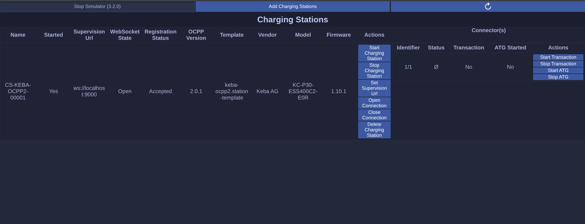

<div align="center">

# Web UI

</div>

The Web UI code and configuration is in the repository directory [ui/web](./../../ui/web/). Commands execution is relative to that directory.

## Table of contents

- [Project setup](#project-setup)
  - [Configuration](#configuration)
    - [Simulator UI Server Configuration](#simulator-ui-server-configuration)
    - [Web UI configuration](#web-ui-configuration)
      - [Unique UI server](#unique-ui-server)
      - [Multiple UI servers](#multiple-ui-servers)
  - [Run](#run)
    - [Compiles and run for production](#compiles-and-run-for-production)
    - [Preview locally](#preview-locally)
    - [Docker](#docker)
  - [Development](#development)
    - [Compiles and run for development](#compiles-and-run-for-development)
    - [Formats files](#formats-files)
    - [Lints and fixes files](#lints-and-fixes-files)

## Project setup

### Configuration

#### Simulator UI Server Configuration

The simulator UI server must be enabled, use WebSocket transport type and have authentication disabled. The simulator main configuration file should have a `uiServer` section like this:

```json
  "uiServer": {
    "enabled": true,
    "type": "ws",
    "authentication": {
      "enabled": true,
      "type": "protocol-basic-auth",
      "username": "admin",
      "password": "admin"
    }
  },
```

See [here](./../../README.md#charging-stations-simulator-configuration) for more details.

#### Web UI configuration

Copy the configuration template [src/assets/config-template.json](./src/assets/config-template.json) to `public/config.json`.

##### Unique UI server

```json
{
  "uiServer": {
    "host": "localhost",
    "port": 8080,
    "protocol": "ui",
    "version": "0.0.1",
    "authentication": {
      "enabled": true,
      "type": "protocol-basic-auth",
      "username": "admin",
      "password": "admin"
    }
  }
}
```

##### Multiple UI servers

```json
{
  "uiServer": [
    {
      "host": "server1.domain.tld",
      "port": 8080,
      "protocol": "ui",
      "version": "0.0.1",
      "authentication": {
        "enabled": true,
        "type": "protocol-basic-auth",
        "username": "admin",
        "password": "admin"
      }
    },
    ...
    {
      "host": "serverN.domain.tld",
      "port": 8080,
      "protocol": "ui",
      "version": "0.0.1",
      "authentication": {
        "enabled": true,
        "type": "protocol-basic-auth",
        "username": "admin",
        "password": "admin"
      }
    }
  ]
}
```

### Run

#### Compiles and run for production

```shell
pnpm preview
```

#### Preview locally

You can now follow the link displayed in the terminal. The Web UI looks like the following:



1. With the buttons on the top you can change UI server, start/stop the simulator, add new charging stations and refresh the content.
2. Each charging station is a row in the table with specific 'Actions' to execute on. Try 'Stop Charging Station' and refresh with the large blue button and see the status 'Started' turns from 'Yes' into 'No'.

#### Docker

In the [docker](./docker) folder:

```shell
make
```

### Development

#### Compiles and run for development

```shell
pnpm dev
```

#### Formats files

```shell
pnpm format
```

#### Lints and fixes files

```shell
pnpm lint:fix
```
