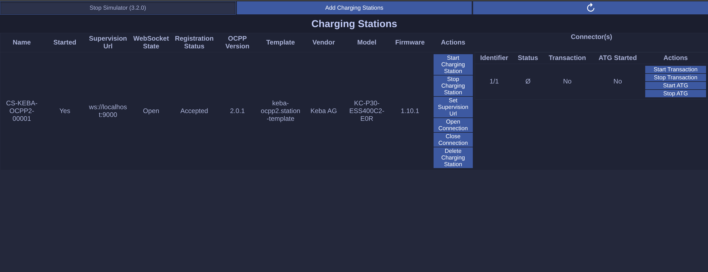

<div align="center">

# Web UI

</div>

Vue.js dashboard for monitoring and controlling the e-mobility charging stations simulator via WebSocket.



1. The top bar lets you switch between UI servers, start/stop the simulator, add charging stations, and refresh the view.
2. Each charging station is a table row with actions: start, stop, open/close connection, start/stop transaction, and more.

## Table of contents

- [Configuration](#configuration)
  - [Simulator UI server](#simulator-ui-server)
  - [Web UI](#web-ui-1)
    - [Single server](#single-server)
    - [Multiple servers](#multiple-servers)
  - [Configuration reference](#configuration-reference)
- [Theming](#theming)
- [Getting started](#getting-started)
  - [Install dependencies](#install-dependencies)
  - [Development](#development)
  - [Production](#production)
    - [Local preview](#local-preview)
    - [Node.js server](#nodejs-server)
    - [Docker](#docker)
- [Available scripts](#available-scripts)

## Configuration

### Simulator UI server

The simulator must have its UI server enabled with WebSocket transport. Add a `uiServer` section to the simulator configuration file:

```json
{
  "uiServer": {
    "enabled": true,
    "type": "ws",
    "authentication": {
      "enabled": true,
      "type": "protocol-basic-auth",
      "username": "admin",
      "password": "admin"
    }
  }
}
```

See the [simulator configuration documentation](./../../README.md#charging-stations-simulator-configuration) for details.

### Web UI

Copy the configuration template to the public directory:

```shell
cp src/assets/config-template.json public/config.json
```

Edit `public/config.json` to point to your simulator UI server(s).

#### Single server

```json
{
  "theme": "tokyo-night-storm",
  "uiServer": {
    "host": "localhost",
    "port": 8080,
    "protocol": "ui",
    "version": "0.0.1",
    "authentication": {
      "enabled": true,
      "type": "protocol-basic-auth",
      "username": "admin",
      "password": "admin"
    }
  }
}
```

#### Multiple servers

The `uiServer` field accepts an array to connect to multiple simulator instances:

```json
{
  "theme": "catppuccin-latte",
  "uiServer": [
    {
      "host": "server1.domain.tld",
      "port": 8080,
      "protocol": "ui",
      "version": "0.0.1",
      "authentication": {
        "enabled": true,
        "type": "protocol-basic-auth",
        "username": "admin",
        "password": "admin"
      }
    },
    {
      "host": "server2.domain.tld",
      "port": 8080,
      "protocol": "ui",
      "version": "0.0.1",
      "authentication": {
        "enabled": true,
        "type": "protocol-basic-auth",
        "username": "admin",
        "password": "admin"
      }
    }
  ]
}
```

### Configuration reference

| Field                     | Type                    | Required | Description                               |
| ------------------------- | ----------------------- | -------- | ----------------------------------------- |
| `skin`                    | `string`                | No       | Skin name (default: `classic`)            |
| `theme`                   | `string`                | No       | Theme name (default: `tokyo-night-storm`) |
| `host`                    | `string`                | Yes      | Simulator UI server hostname              |
| `port`                    | `number`                | Yes      | Simulator UI server port                  |
| `protocol`                | `"ui"`                  | Yes      | WebSocket subprotocol                     |
| `version`                 | `"0.0.1"`               | Yes      | Protocol version                          |
| `name`                    | `string`                | No       | Display name for server selection         |
| `secure`                  | `boolean`               | No       | Use `wss://` instead of `ws://`           |
| `authentication.enabled`  | `boolean`               | No       | Enable authentication                     |
| `authentication.type`     | `"protocol-basic-auth"` | No       | Authentication method                     |
| `authentication.username` | `string`                | No       | Basic auth username                       |
| `authentication.password` | `string`                | No       | Basic auth password                       |

## Theming

Set `theme` in `config.json` to a filename (without `.css`) from `src/assets/themes/`.

| Theme               | Style | Source                                                           |
| ------------------- | ----- | ---------------------------------------------------------------- |
| `tokyo-night-storm` | Dark  | [Tokyo Night](https://github.com/enkia/tokyo-night-vscode-theme) |
| `catppuccin-latte`  | Light | [Catppuccin](https://github.com/catppuccin/catppuccin)           |
| `sap-horizon`       | Light | [SAP Horizon](https://github.com/SAP/theming-base-content)       |

Default: `tokyo-night-storm`. To add a theme, create a CSS file defining the same semantic tokens.

## Skins

Set `skin` in `config.json` to select the default UI layout. Users can switch skins at runtime using the selector in the top bar.

| Skin      | Layout                                            |
| --------- | ------------------------------------------------- |
| `classic` | Table-based rows with a sticky sidebar for forms. |
| `modern`  | Responsive card grid with modal dialogs.          |

Default: `classic`. To add a skin, create `src/skins/<name>/`, implement a root layout component, and register it in `src/skins/registry.ts`.

> **Browser requirement**: The `modern` skin uses CSS `color-mix()` extensively. This requires Chrome 111+, Safari 16.2+, or Firefox 113+ (all released by May 2023). Users on older browsers should use the `classic` skin.

## Getting started

### Install dependencies

```shell
pnpm install
```

### Development

Start the Vite development server with hot-reload:

```shell
pnpm dev
```

### Production

#### Local preview

Build and preview the production bundle locally with Vite:

```shell
pnpm preview
```

#### Node.js server

Build and serve the production bundle with a static Node.js HTTP server on port 3030:

```shell
pnpm start
```

#### Docker

From the [`docker`](./docker) directory:

```shell
make
```

This builds the image and runs the container, exposing the Web UI on port 3030. The Docker build uses `docker/config.json` as the default configuration.

## Available scripts

| Script               | Description                                         |
| -------------------- | --------------------------------------------------- |
| `pnpm dev`           | Start Vite development server with hot-reload       |
| `pnpm build`         | Build the production bundle to `dist/`              |
| `pnpm preview`       | Build and preview the production bundle locally     |
| `pnpm start`         | Build and serve via Node.js HTTP server (port 3030) |
| `pnpm typecheck`     | Run vue-tsc type checking                           |
| `pnpm lint`          | Run ESLint                                          |
| `pnpm lint:fix`      | Run ESLint with auto-fix                            |
| `pnpm format`        | Run Prettier and ESLint auto-fix                    |
| `pnpm test`          | Run unit tests with Vitest                          |
| `pnpm test:coverage` | Run unit tests with V8 coverage report              |
